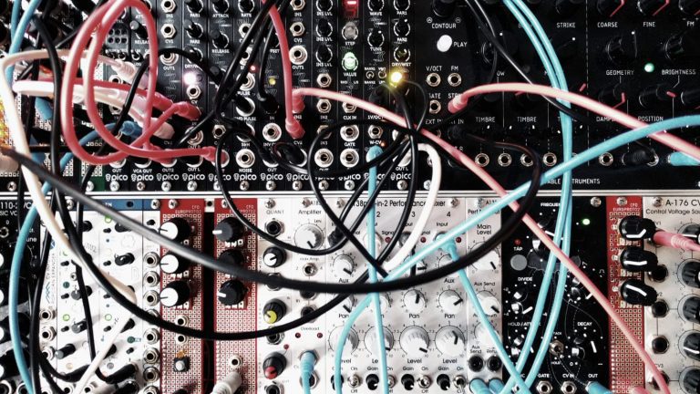

# CFO EUROPROTO 1
# digital modular

workshop participants will learn to prototype simple arduino based modules that can interact with the eurorack modular world.  

programming microcontrollers in eurorack format, brings a dirty, cheap and flexible hacking approach to eurorack modular. by introducing programmable digital utility modules in the modular world we open up a pandoras box of algorithmic composition and wonderful glitches.  

the outcome of the workshop will be true hybrid modular systems that is self playing and self modulating. saturday night the workshop participants will gather for a massive common patch jam based on produced modules and doepfer a-100 system which is already available for us in mplab.  

http://sound.mplab.lv/workshops/jacob-remin/
jacob remin, liepaja, 2-5 may 2019

## teachers

jacob remin & reinis nalivaiko

## links / references

https://vsionhairies.info/
http://www.jacobremin.com/
https://www.arduino.cc/
http://sound.mplab.lv/

## thanks!

erica synths
https://www.ericasynths.lv/
nordic culture point
https://www.nordiskkulturkontakt.org

## more infos

[build instructions](https://github.com/jsr606/EUROPROTO/tree/master/SoundDays_MPlab/build_instructions)