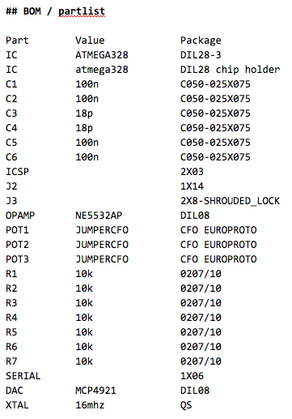
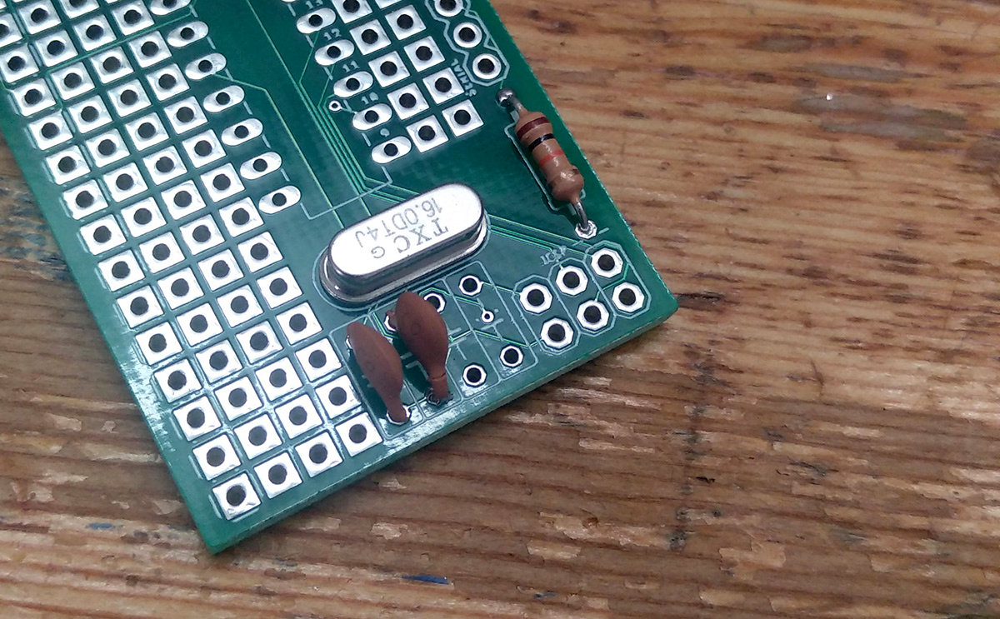

# CFO EUROPROTO 1
# build instructions
for digital modular workshop at MPlab sound days  
http://sound.mplab.lv/workshops/jacob-remin/  
jacob remin, liepaja, may 2019  

## BOM

# soldering

if you have never soldered before, i recommend looking at [this little instructional cartoon](https://blog.adafruit.com/2010/02/19/soldering-is-easy-heres-how-to-do-it-comic/)

say hello to your PCB

first solder the resistors. they are all 10k ohm. they have no polarity, but try to align them all the same way. just pick one. it makes it easier to see what is going on for other people (or yourself in a couple of weeeks)

solder the 16mhz chrystal. the crystal has no polarity

solder the 18pf capacitors. they have no polarity

solder the 100uf capacitors. again no polarity here

solder the IC sockets. NB: make sure to orient them correctly

solder the programmer pin headers

solder the power connector. for this workshop we will use 2 rows of ordinary male pin headers. to make sure they fit your eurorack power cable, connect the pin headers to the power cable while soldering them. this way they are correctly aligned

to route the potentiometers 3 pins to the atmega328, apply solder to the 3 solder bridges marked POT1, POT2, and POT3

solder the angled pin headers to the back of the PCB. NB: careful with the orientation: if you solder the pin headers to the top of the PCB your module will not fit in your synthesizer!

mount the ICs in the IC sockets. NB: mind the orientation of the chips, and be careful not to mix up the DAC and the opamp

mount the ICs in the IC sockets. NB: mind the orientation of the chips, and be careful not to mix up the DAC and the opamp

that's it! you're done :) now we need to add a faceplate and program it

# faceplate

now it gets interesting! you have to decide on how many plugs your module needs. if in doubt, i suggest 3 plugs.

mark on the PCB where you want to position the plugs and drill holes :) NB: make sure you can fit the plugs and the electronics on the backside, when you solder faceplate and mainboard together. see pics below for suggested placement:

once you have the plugs mounted on the faceplate it's time to solder the potentiometers.

when connecting the faceplate to the mainboard be sure everything is aligned in a perfect 90 degree angle: solder one or two pins and calibrate before soldering all the pins. NB: if things are not straight, you module might not fit in inside your synthesizer!

connect the ground pins of the audio jacks together. and wire the jacks to GND on the mainboard.

connect AMP1 to audio / CV out